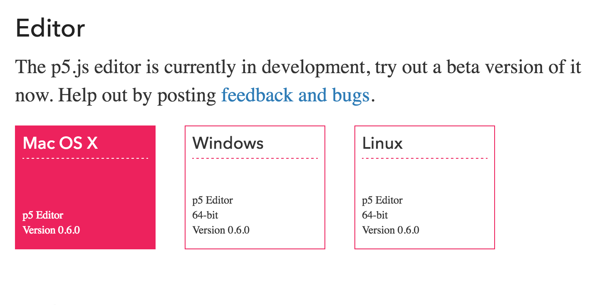

# 1-1: 安裝

### 懶人使用
如果你對網頁開發還很陌生，建議前往官網下載 [p5 Editor](https://p5js.org/download/#editor)，不需要任何前置作業即可開始使用，記得選擇適合的作業系統版本。本書的所有範例將使用此方法展示。


### 一般使用
如果已經熟悉基本前端網頁運作方式，且有習慣的文字編輯器，建議使用此方法來開發。
1. 前往官網下載 [p5.js](https://github.com/processing/p5.js/releases/download/0.5.2/p5.js)
2. 新增你的 `.html` 檔案，並且適當的引入 `p5.js`

```html
<!DOCTYPE html>
<html>
  <head>
    <script src='path/to/p5.js'></script>
  </head>
  <body>
  </body>
<html>
```
